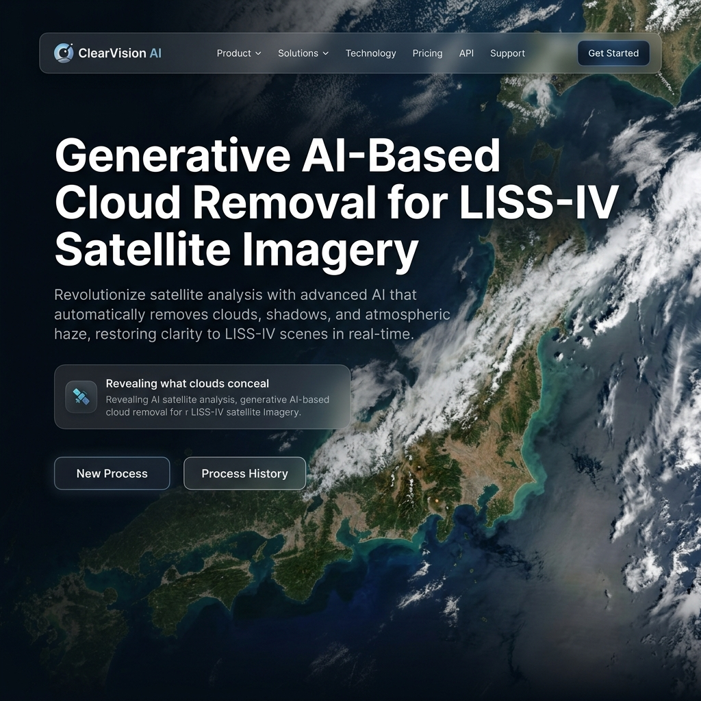
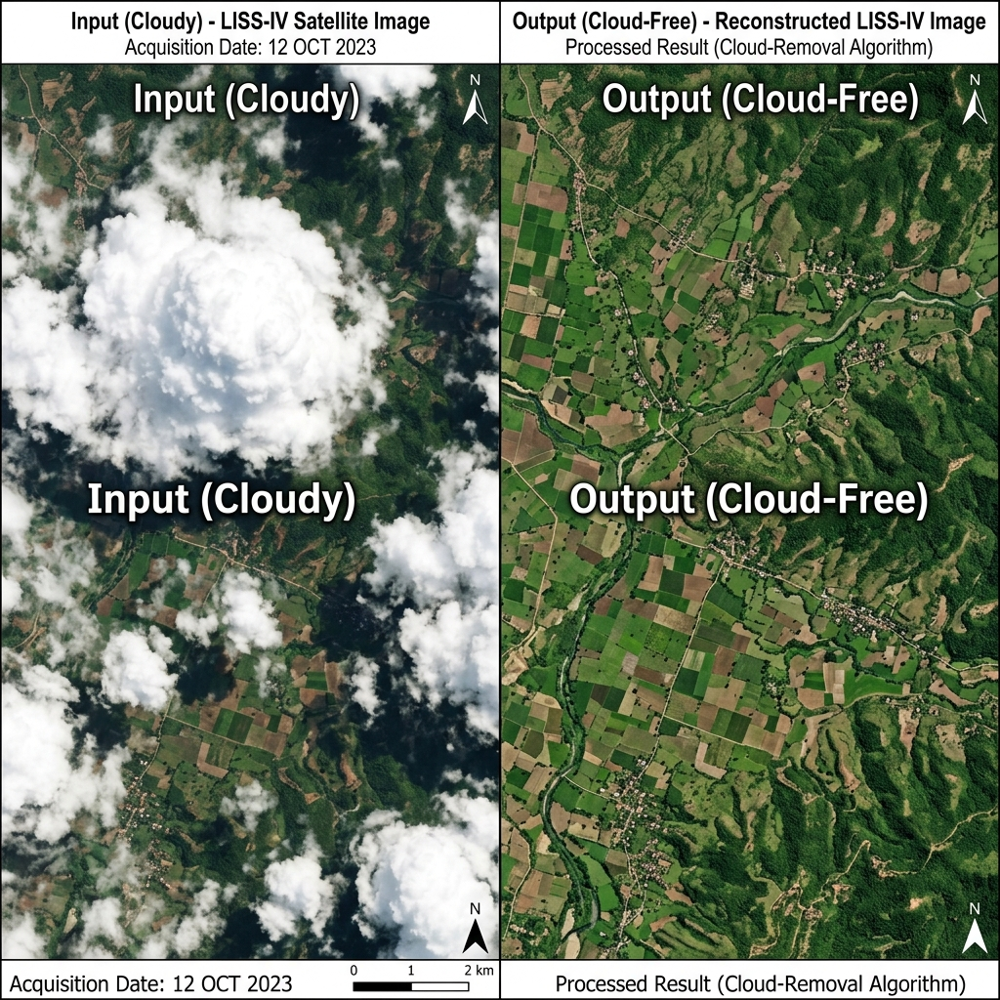
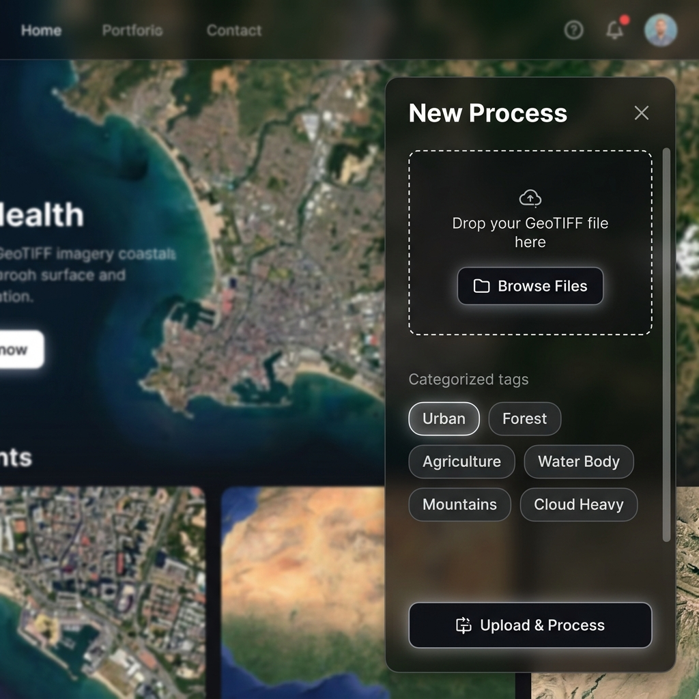

# 🛰️ ClearVision AI — Satellite Imagery Cloud Removal

<div align="center">



**Generative AI-Based Cloud Removal for LISS-IV Satellite Imagery**

[](https://python.org)
[](https://fastapi.tiangolo.com)
[](https://react.dev)
[](https://vite.dev)
[](https://tailwindcss.com)
[](https://pytorch.org)

*Developed for the ISRO Cloud Imagery Hackathon Challenge*

</div>

---

## 🌤️ Overview

Cloud cover is one of the biggest challenges in optical satellite imaging, especially in the **North Eastern Region of India** where cloudy conditions persist for several months. **ClearVision AI** addresses this problem by using a **Generative AI-based system** that removes clouds from LISS-IV satellite images and reconstructs the hidden regions to produce clear, analysis-ready imagery.

The platform provides an end-to-end pipeline: from uploading cloudy GeoTIFF images to receiving cloud-free outputs with quantitative evaluation metrics.



---

## ✨ Key Features

| Feature | Description |
|---------|-------------|
| 🧠 **Hybrid CNN-Transformer Model** | Custom deep learning architecture combining CNN's spatial feature extraction with Transformer's global context understanding |
| 🛰️ **LISS-IV Optimized** | Specifically trained on ISRO's high-resolution LISS-IV sensor data, preserving spectral signatures and spatial clarity |
| 📊 **Instant Evaluation Metrics** | Automatic computation of PSNR, SSIM, MAE, and RMSE for objective quality assessment |
| ⚡ **Fast Inference** | FastAPI backend with Celery workers for non-blocking, asynchronous image processing |
| 🎨 **Premium Dark Glass UI** | Modern glassmorphism interface with translucent panels, smooth animations, and responsive design |
| 📁 **GeoTIFF Support** | Native support for `.tif` and `.tiff` satellite imagery with geographic metadata preservation |
| 🏷️ **Smart Tagging** | Categorize uploads with tags like Urban, Forest, Agriculture, Water Body, Mountains, Cloud Heavy |
| 📜 **Process History** | Track all processed images with timestamps, tags, and job IDs |

---

## 🖥️ Screenshots

<div align="center">

### Upload Panel

*Translucent slide-in panel with file upload, tag selection, and the hero section blurred in the background*

</div>

---

## 🏗️ Architecture

### System Overview

```
┌─────────────────────────────────────────────────────┐
│                   React Frontend                     │
│  ┌──────────┐ ┌──────────┐ ┌──────────┐ ┌────────┐ │
│  │   Hero   │ │  Upload  │ │ History  │ │  Docs  │ │
│  │ Section  │ │  Panel   │ │  Panel   │ │ Panel  │ │
│  └──────────┘ └──────────┘ └──────────┘ └────────┘ │
└────────────────────────┬────────────────────────────┘
                         │ REST API (HTTP)
┌────────────────────────▼────────────────────────────┐
│                  FastAPI Backend                     │
│  ┌──────────┐ ┌──────────┐ ┌──────────────────────┐ │
│  │  Routes  │ │  Config  │ │   ML Model Inference │ │
│  │  /upload │ │  .env    │ │   (PyTorch + GDAL)   │ │
│  └──────────┘ └──────────┘ └──────────────────────┘ │
└────────────────────────┬────────────────────────────┘
                         │ Task Queue
┌────────────────────────▼────────────────────────────┐
│              Celery + Redis Workers                   │
│        Background processing of GeoTIFF images       │
└──────────────────────────────────────────────────────┘
```

### Deep Learning Pipeline

1. **Data Collection** — Satellite images from LISS-IV, Sentinel-1 SAR, and Sentinel-2 optical data
2. **Cloud Masking** — Automated identification of cloud-covered regions
3. **Preprocessing** — Image normalization, patching, and augmentation
4. **Inference** — Hybrid CNN-Transformer model reconstructs cloud-covered areas
5. **Post-processing** — Patch reassembly and GeoTIFF metadata restoration
6. **Evaluation** — Automatic quality metrics computation (PSNR, SSIM, MAE, RMSE)

---

## 📂 Project Structure

```
ClearVision_AI_Satellite_Imagery/
├── project/
│   ├── backend/
│   │   ├── app.py              # FastAPI application entry point
│   │   ├── routes/             # API route handlers
│   │   ├── models/             # ML model definitions (PyTorch)
│   │   ├── checkpoints/        # Trained model weights
│   │   ├── config/             # Configuration files
│   │   ├── database/           # Database utilities
│   │   ├── datasets/           # Dataset loaders and processors
│   │   ├── training/           # Model training scripts
│   │   ├── utils/              # Helper utilities (GDAL, Rasterio)
│   │   ├── storage/            # Upload and output file storage
│   │   ├── logs/               # Application logs
│   │   ├── requirements.txt    # Python dependencies
│   │   └── .env.example        # Environment variable template
│   └── frontend/
│       ├── src/
│       │   ├── components/
│       │   │   ├── Hero.tsx         # Main hero section with video background
│       │   │   ├── UploadPanel.tsx   # GeoTIFF upload slide-in panel
│       │   │   ├── HistoryPanel.tsx  # Process history viewer
│       │   │   ├── DocsPanel.tsx     # Project documentation panel
│       │   │   ├── AnimatedHeading.tsx # Animated text component
│       │   │   └── FadeIn.tsx       # Fade-in animation wrapper
│       │   ├── App.tsx
│       │   └── index.css
│       ├── public/
│       │   └── model-architecture.png
│       ├── vite.config.ts
│       └── package.json
├── docs/
│   └── images/              # README screenshots and diagrams
├── .gitignore
└── README.md
```

---

## 🚀 Getting Started

### Prerequisites

| Requirement | Version |
|------------|---------|
| Python | 3.9+ |
| Node.js | 18+ |
| Redis | Latest (for Celery background tasks) |
| CUDA (optional) | 11.8+ (for GPU-accelerated inference) |

### Backend Setup

```bash
# 1. Navigate to the backend directory
cd project/backend

# 2. Create and activate a virtual environment
python -m venv venv
source venv/bin/activate        # Linux/macOS
venv\Scripts\activate           # Windows

# 3. Install Python dependencies
pip install -r requirements.txt

# 4. Configure environment variables
cp .env.example .env
# Edit .env with your settings:
#   CELERY_BROKER_URL=redis://localhost:6379/0
#   UPLOAD_DIR=storage/uploads
#   OUTPUT_DIR=storage/outputs
#   MAX_FILE_SIZE_MB=50

# 5. Start the FastAPI server
cd ..
uvicorn backend.app:app --host 0.0.0.0 --port 8000
```

The API will be available at `http://localhost:8000`. Interactive API docs at `http://localhost:8000/docs`.

### Frontend Setup

```bash
# 1. Navigate to the frontend directory
cd project/frontend

# 2. Install Node dependencies
npm install

# 3. Start the development server
npm run dev
```

The UI will be accessible at `http://localhost:5173`.

---

## 📖 Usage

1. **Open** the frontend at `http://localhost:5173`
2. **Click** "New Process" to open the upload panel
3. **Drag & drop** or browse for a LISS-IV GeoTIFF satellite image (`.tif` / `.tiff`)
4. **Select tags** to categorize your image (Urban, Forest, Agriculture, etc.)
5. **Click** "Upload & Process" to submit the image for cloud removal
6. **View results** — the processed cloud-free image and quality metrics will be displayed
7. **Track history** — all processed images are saved in the Process History panel

---

## 🔬 Model Details

### Hybrid CNN-Transformer Architecture

The model combines the strengths of two deep learning paradigms:

- **CNN Branch**: Extracts local spatial features and texture patterns from satellite imagery
- **Transformer Branch**: Captures long-range dependencies and global context for coherent reconstruction
- **Fusion Module**: Merges both representations for high-quality cloud-free output

### Training Details

| Parameter | Value |
|-----------|-------|
| Loss Functions | Perceptual Loss + L1 Loss + Adversarial Loss |
| Optimizer | AdamW |
| Input Resolution | 256×256 patches |
| Training Data | LISS-IV + Sentinel-1/2 paired imagery |
| Auxiliary Data | DEM (elevation) + Land-cover maps |

### Evaluation Metrics

| Metric | Description |
|--------|-------------|
| **PSNR** | Peak Signal-to-Noise Ratio — measures reconstruction fidelity |
| **SSIM** | Structural Similarity Index — evaluates structural preservation |
| **MAE** | Mean Absolute Error — pixel-level accuracy |
| **RMSE** | Root Mean Square Error — overall reconstruction quality |

---

## 🛠️ Tech Stack

### Frontend
- **React 18** — Component-based UI framework
- **Vite 8** — Next-generation build tool with HMR
- **Tailwind CSS** — Utility-first CSS framework
- **TypeScript** — Type-safe development
- **Framer Motion** — Smooth animations and transitions

### Backend
- **FastAPI** — High-performance async Python web framework
- **Celery** — Distributed task queue for background processing
- **Redis** — Message broker for Celery workers
- **PyTorch** — Deep learning model training and inference
- **GDAL / Rasterio** — Geospatial data processing
- **OpenCV** — Image processing utilities
- **NumPy / Matplotlib** — Scientific computing and visualization

---

## 🤝 Contributing

Contributions are welcome! Please feel free to submit a Pull Request.

1. Fork the repository
2. Create your feature branch (`git checkout -b feature/AmazingFeature`)
3. Commit your changes (`git commit -m 'Add some AmazingFeature'`)
4. Push to the branch (`git push origin feature/AmazingFeature`)
5. Open a Pull Request

---

## 📄 License

This project is developed as part of the **ISRO Cloud Imagery Hackathon Challenge**.

---

<div align="center">

**Built with ❤️ for clearer skies**

*ClearVision AI © 2026*

</div>